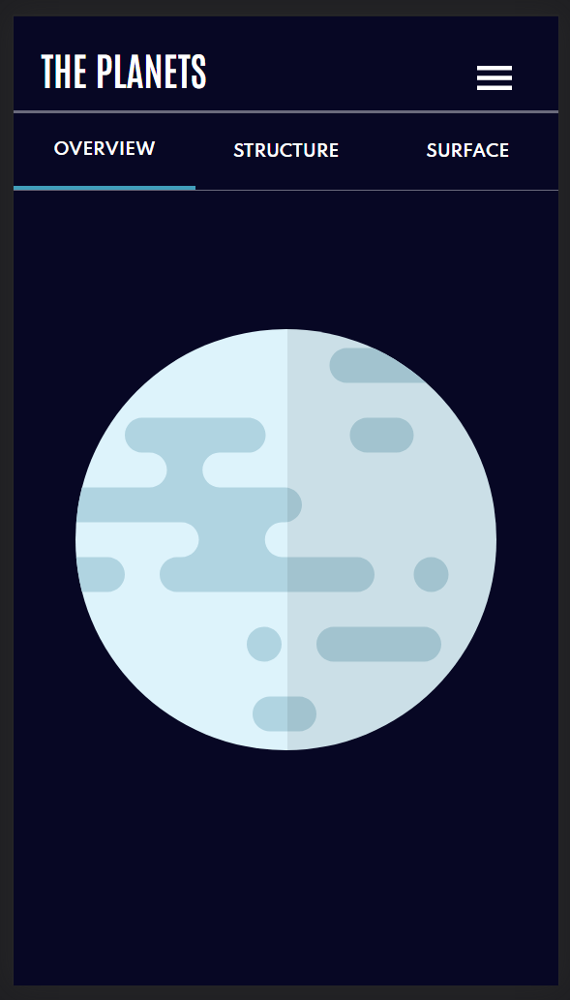
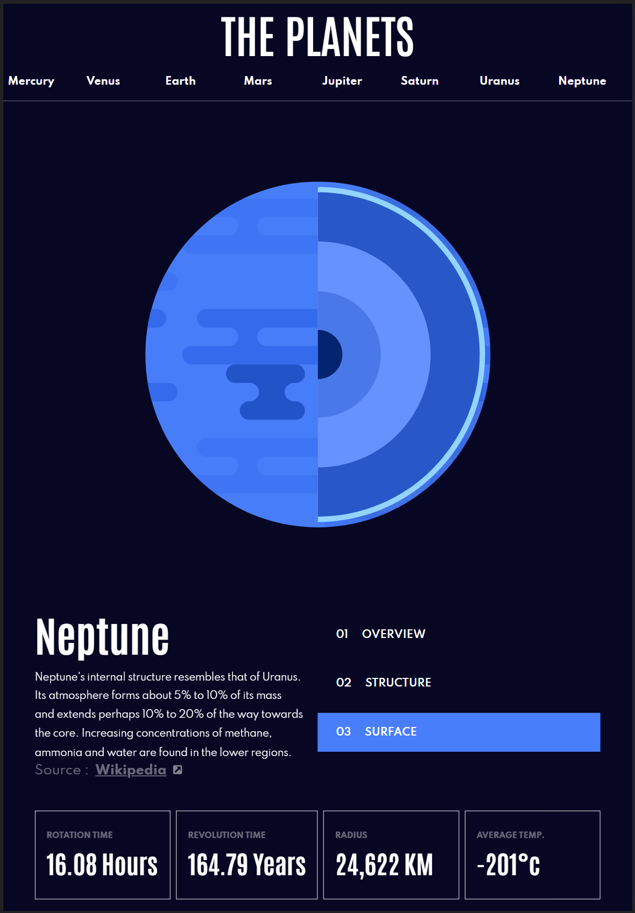
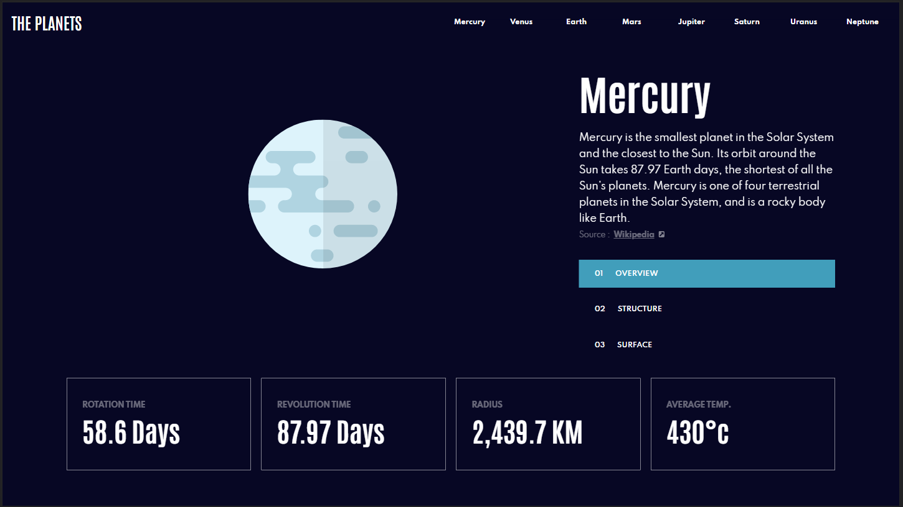

# Frontend Mentor - Planets fact site solution

This is a solution to the [Planets fact site challenge on Frontend Mentor](https://www.frontendmentor.io/challenges/planets-fact-site-gazqN8w_f). Frontend Mentor challenges help you improve your coding skills by building realistic projects.

## Table of contents

- [Overview](#overview)
  - [The challenge](#the-challenge)
  - [Screenshot](#screenshot)
  - [Links](#links)
- [My process](#my-process)
  - [Built with](#built-with)
  - [What I learned](#what-i-learned)
  - [Continued development](#continued-development)
  - [Useful resources](#useful-resources)
- [Author](#author)
- [Acknowledgments](#acknowledgments)


## Overview

### The challenge

Users should be able to:

- View the optimal layout for the app depending on their device's screen size
- See hover states for all interactive elements on the page
- View each planet page and toggle between "Overview", "Internal Structure", and "Surface Geology"

### Screenshot


# Mobile
<p align='center'>
  
</p>

# Tablet
<p align='center'>
  
</p>

# Desktop
<p align='center'>
  
</p>

### Links

- Solution URL: [Responsive Planet App](https://www.frontendmentor.io/solutions/responsive-planet-app-kd1_iCTFZG)
- Live Site URL: [UreaLaden/planetarium](planetarium-five.vercel.app/)

## My process

### Built with

- Semantic HTML5 markup
- CSS custom properties
- Flexbox
- CSS Grid
- Mobile-first workflow
- [React](https://reactjs.org/) - JS library
- [Next.js](https://nextjs.org/) - React framework
- [Styled Components](https://styled-components.com/) - For styles


### What I learned

- I didn't realize until I was basically done, but I can switch the orientation between landscape and portrait from the dev tools. Obviously this broke a lot of my mobile and tablet views. In my next project I'll be sure to account for this.
- Although it was nice using this project as an introduction into using Next.js, I quickly learned it was really overkill for this project. There was really no need to use any type of routes as long as I had React context. In future projects, I'll keep this in mind.

To see how you can add code snippets, see below:

```html
<h1>Some HTML code I'm proud of</h1>
```

```css
.proud-of-this-css {
  color: papayawhip;
}
```

```js
const onOverviewButtonSelected = () => {
    router.push({
      pathname: "/planets/[planetId]/[reportId]",
      query: { planetId: context.currentPlanet?.id, reportId: 1 },
    });
  };

  const onStructureButtonSelected = () => {
    router.push({
      pathname: "/planets/[planetId]/[reportId]",
      query: { planetId: context.currentPlanet?.id, reportId: 2 },
    });
  };

  const onSurfaceButtonSelected = () => {
    router.push({
      pathname: "/planets/[planetId]/[reportId]",
      query: { planetId: context.currentPlanet?.id, reportId: 3 },
    });
  };
  const window: WindowSpec = useWindowSize();

  const isMobileView = React.useMemo(() => {
    return window.width < 765;
  }, [window]);

  return (
    <div className={styles.detailsButtonContainer}>
      <Button
        controlId={1}
        selectedItem={(id: number) => id === context.currentPlanetSpec?.id}
        isMobileView={isMobileView}
        title={"OVERVIEW"}
        onButtonClicked={onOverviewButtonSelected}
      />
      <Button
        controlId={2}
        selectedItem={(id: number) => id === context.currentPlanetSpec?.id}
        isMobileView={isMobileView}
        title={"STRUCTURE"}
        onButtonClicked={onStructureButtonSelected}
      />
      <Button
        controlId={3}
        selectedItem={(id: number) => id === context.currentPlanetSpec?.id}
        isMobileView={isMobileView}
        title={"SURFACE"}
        onButtonClicked={onSurfaceButtonSelected}
      />
    </div>
};
```


### Continued development

I can definitely see improvement in my front end abilities. Moving forward I want to take more time on the 'frontend' to actually plan what I want to accomplish as it could have save me some time before installing NextJS.

## Author

- Website - [Leaundrae Mckinney](https://www.linkedin.com/in/leaundraemckinney)
- Frontend Mentor - [@UreaLaden](https://www.frontendmentor.io/profile/urealaden)